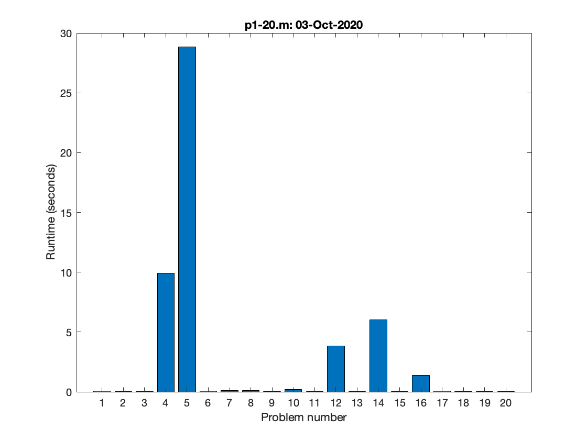

# Project-Euler

Repository for my solutions to Project Euler problems using MATLAB R2020b. My PE profile can be found [here](https://projecteuler.net/profile/nrwade0.png). Other MATLAB problems are completed on [Cody](https://www.mathworks.com/matlabcentral/profile/authors/10468752-nick-wade), but these are generally not even script-worthy. I Finally learned how to use [GitHub pages](https://nrwade0.github.io/Project-Euler/).

Using `Symbolic Math Toolbox` to solve some high memory problems.

## Progress

## Runtimes

Runtime histogram for the first folder 1-20.

