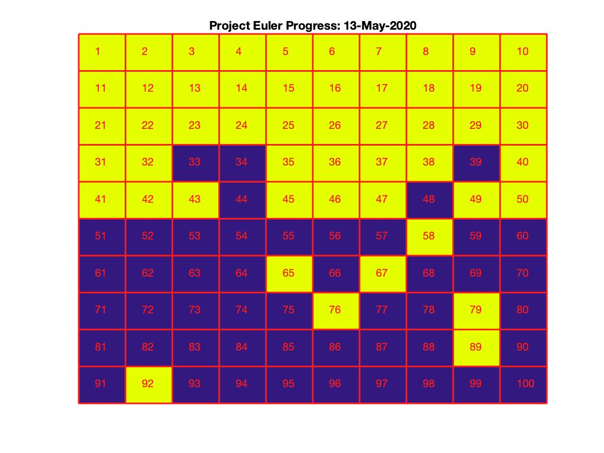

# Project-Euler

Repository for my solutions to Project Euler problems using MATLAB R2020a. My profile can be found [here](https://projecteuler.net/profile/nrwade0.png). Feel free to add a solution of your own or help fix any issues listed! Other MATLAB problems are completed on [Cody](https://www.mathworks.com/matlabcentral/profile/authors/10468752-nick-wade), but these are not script-worthy.

Also using `Symbolic Math Toolbox` to solve some high memory problems.

